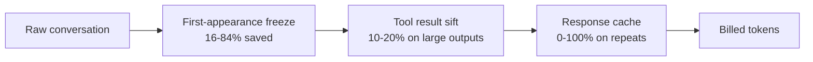
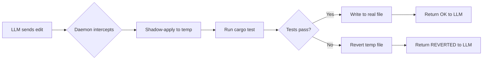
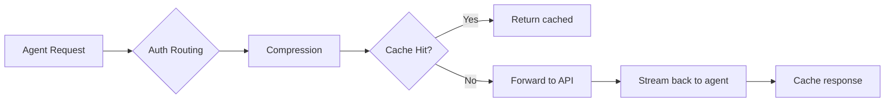
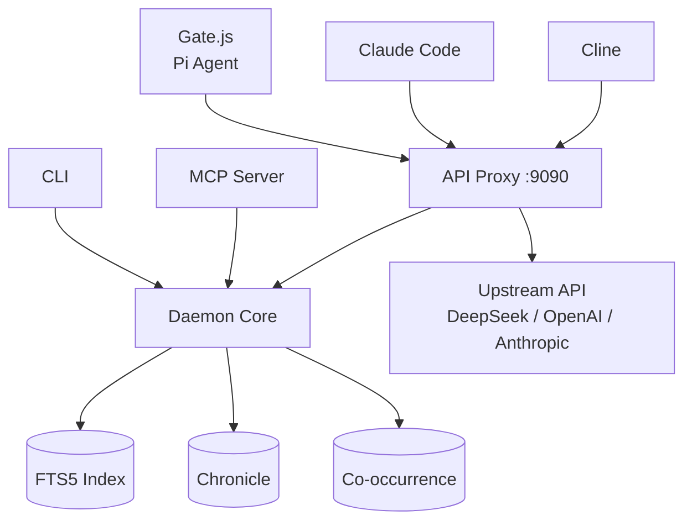

# reliary-agent

Grammar-free code intelligence daemon, CLI, MCP server, and API proxy.

**One binary. All local. No server required.**

Save 16-84% on API tokens and eliminate debug spirals across any agent framework — Pi, Claude Code, Cline, OpenCode.

- [Quickstart](#quickstart)
- [Install](#install)
- [Features](#features)
- [Usage by Agent](#usage-by-agent)
- [CLI](#cli)
- [API Proxy](#api-proxy)
- [Output Formats](#output-formats)
- [Configuration](#configuration)
- [Development](#development)

## Quickstart

```bash
cargo install reliary-agent

# Auto-detect and configure your agents (Pi, Claude, Cline, OpenCode)
reliary-agent init

# Or start manually
reliary-agent serve &              # daemon + proxy on :9090
reliary-agent index ./project      # build FTS5 search index
```

After `init`, your agents have access to the daemon's MCP tools (search, risk, heal).
For proxy-based conversation compression, see [API Proxy](#api-proxy).

## Install

```bash
cargo install reliary-agent
```

Or download a release tarball:

```bash
curl -sSfL https://github.com/Reliary/reliary-agent/releases/latest/download/reliary-$(uname -m)-unknown-linux-gnu.tar.gz | tar xz
cd reliary-* && ./install.sh
```

## Features

### Token Compression

| Layer | Where | Savings | How |
|---|---|---|---|
| **First-appearance freeze** | Proxy (:9090) — all agents | 16-84% | Compress every message on first occurrence, freeze in cache, KV cache hits forever |
| **Sift (structural collapse)** | Gate.js + proxy — all agents | 10-20% on tool output | Collapse repeated Compiling/ok/blank lines, preserve errors |
| **Response cache** | Proxy | 0-100% | Repeated requests (same model, same messages) return cached results — zero cost on retries |



### Code Intelligence (MCP tools)

```bash
reliary-agent search "bm25_idf" ./project          # FTS5 search
reliary-agent risk ./src/main.rs                    # Pre-edit risk analysis
reliary-agent compress "Let me think..."            # Reasoning compression
reliary-agent dead ./project                        # Dead code detection
```

Every tool also available through MCP — works with Claude Code, Cline, OpenCode.

### Self-Healing Edits

When the LLM edits a file, `reliary` shadow-applies the change, runs tests, and reverts if tests fail. The LLM never sees the failure spiral.



### Safety Features

- **Guard (on by default):** Intercepts edit tool calls, checks new content against FTS5 index. If an edit would orphan cross-file references, a warning is injected before the edit reaches the LLM. Average -72% weighted cost on cross-file rename tasks by preventing debug spirals.
- **Transparent strict mode:** Instead of blocking bash/write/grep with error messages, gate.js transparently redirects to sandbox tools (test/read/search/create/edit). The LLM never sees "blocked." 100% pass rate (was 71% with blocking errors). Auto-deescalates to reactive mode after 5 redirects.
- **Self-healing edits:** Shadow-apply changes, run tests, revert on failure. The LLM never sees the failure spiral.
- **Identifier veto:** Blocks edits that reference hallucinated API names.
- **Risk gate:** Warns before editing files with high blast radius.

```mermaid
flowchart LR
    A[LLM attempts bash] --> B{Strict mode?}
    B -->|Yes| C[Redirect transparently<br/>test/read/search/edit]
    B -->|No| D[Pass through with monitoring]
    C --> E{5+ redirects?}
    E -->|Yes| F[Auto-deescalate to reactive]
    E -->|No| G[Continue sandbox]

## Usage by Agent

| Agent | What `reliary-agent init` does | Savings |
|---|---|---|
| **Pi** | Installs gate.js (tool-level compression + safety) | 30-50% |
| **Claude Code** | Injects MCP server config (`reliary-agent mcp`) | 15-25% |
| **Cline** | Injects MCP server config (`reliary-agent mcp`) | 15-25% |
| **OpenCode** | Injects MCP server config (`reliary-agent mcp`) | 15-25% |

## CLI

```bash
# Explore
reliary-agent index ./project         # Build FTS5 search index
reliary-agent search "query" ./path   # Search index
reliary-agent risk ./src/file.rs      # Pre-edit risk analysis
reliary-agent dead ./project          # Dead code detection

# Edit
reliary-agent fix-dir ./project       # Apply stored fix patterns
reliary-agent fix-file file old new   # Apply pattern to single file

# Services
reliary-agent serve                   # Daemon + proxy (:9090)
reliary-agent init                    # Auto-configure agents
reliary-agent doctor                  # System health check
reliary-agent status                  # Project intelligence overview
reliary-agent logs                    # Tail daemon logs

# Config
reliary-agent config                  # Show current settings
reliary-agent config mode strict      # Set safety level (fast/reactive/strict)
```

## API Proxy

The `serve` command starts an OpenAI-compatible compression proxy on `localhost:9090`.
Point any agent at it to get conversation compression without installing gate.js:

```bash
# Start proxy
reliary-agent serve &

# Point your agent to it (choose the right base URL for your provider)
export DEEPSEEK_BASE_URL=http://localhost:9090/v1   # Pi, Cline, OpenCode
export ANTHROPIC_BASE_URL=http://localhost:9090/      # Claude Code only
pi --model deepseek/deepseek-v4-flash --print "fix bug"
```

> **Note:** `reliary-agent init` only configures MCP tools. To get proxy compression,
> set the `BASE_URL` environment variable per the table above — or configure it
> directly in your agent's config file (Pi, Cline, and OpenCode all support
> `baseUrl` in their provider settings).



**Provider-agnostic routing:** The proxy automatically detects the API provider
from the `Authorization` header. OpenAI, Anthropic, and DeepSeek keys all route
to the correct upstream without manual configuration.

**True SSE streaming:** The proxy streams chunks back to the client in real-time,
preserving the typewriter effect in your agent's UI.

**First-appearance freeze compression:** Every message is compressed on its first
occurrence and frozen in cache. The provider never sees the uncompressed version,
so KV cache hits are preserved across turns. Two compressors are applied:
- **Tool results** (sift): cargo/build output collapsed (~71-93% smaller)
- **Assistant reasoning** (compress_reasoning): verbose prose stripped (~40-60%
  smaller, only fires on messages >300 chars)
- **Total savings: ~16% average, up to 84% on long multi-turn sessions**

**Guard (on by default):** The proxy intercepts edit tool calls in the assistant's
response and checks new content against the FTS5 index. If an edit would orphan
cross-file references (e.g., renaming a function without updating callers), a
warning is injected before the edit reaches the LLM. Benchmark: -72% weighted
cost on cross-file rename tasks by preventing debug spirals.

## Output Formats

```bash
# Human (default)
reliary-agent search "merge_sort" ./project

# Agent (compact)
reliary-agent -f compact search "merge_sort" ./project
# → 4.2294 ./src/sort.rs

# CI (JSON)
reliary-agent -f json dead ./project | jq '.[] | select(contains("HIGH"))'
```

## Configuration

See [CONFIG.md](./CONFIG.md) for the full documentation.

### Quick Reference

| Env var | Effect |
|---|---|
| `RELIARY_MODE=fast` | Maximum compression (no safety rails) |
| `RELIARY_MODE=reactive` | Safety escalates on unsafe behavior (default) |
| `RELIARY_MODE=strict` | Full sandbox (bash blocked, edits always healed) |
| `RELIARY_FEATURES=+editMerge,-taskTargets` | Toggle individual features |
| `RELIARY_UPSTREAM_URL=https://api.openai.com/v1` | Set API upstream (default: auth-based routing) |
| `RELIARY_PROXY_GUARD_DISABLE=1` | Disable guard (cross-file edit safety) — on by default |
| `DEEPSEEK_BASE_URL=http://localhost:9090/v1` | Route Pi/Cline/OpenCode through proxy |
| `ANTHROPIC_BASE_URL=http://localhost:9090/` | Route Claude Code through proxy |

## Architecture

This binary consolidates 9 crates — each ported from a standalone tool — into one
binary. Shared tokenizer, shared session state, no IPC overhead.



- **search:** BM25 + FTS5, Porter stemming, phrase extraction (from stria)
- **compress:** IR reasoning compression (from gate.js)
- **sift:** Structural compression, entropy/diversity gates (from sift + maxwell)
- **risk:** Pre-edit risk scores, blast radius (from quale)
- **memory:** HDC 10K-bit vectors, Hebbian learning (from cortex-rs)
- **fix:** Pattern extraction, content matching, signature matching (from cortex-rs)
- **dead:** Grammar-free dead code via occurrence counting (from carrion)
- **agent:** Binary — daemon, proxy (axum + tokio), CLI, MCP

## Development

```bash
cargo build --release
cargo test --release
reliary-agent serve &    # start daemon + proxy
```

## Documentation

- **[CONFIG.md](./CONFIG.md)** — Mode system, feature flags, config cascade
- **[SECURITY.md](./SECURITY.md)** — Vulnerability disclosure and security policy
- **[CONTRIBUTING.md](./CONTRIBUTING.md)** — Build, test, PR workflow

## License

MIT
