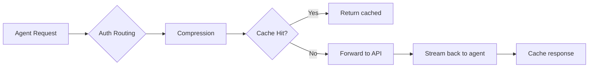
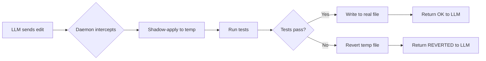
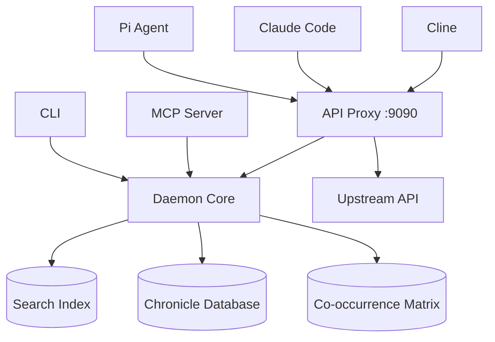

# reliary-agent

[](https://crates.io/crates/reliary-agent)
[](https://www.npmjs.com/package/@reliary/agent)
[](https://github.com/Reliary/reliary-agent/actions/workflows/ci.yml)
[](https://opensource.org/licenses/MIT)

Grammar-free code intelligence daemon, CLI, MCP server, and API proxy.

**One binary. All local. No server required.**

Save 16-84% on API tokens and eliminate debug spirals across any agent framework — Pi, Claude Code, Cline, OpenCode.

- [Installation](#installation)
- [Quickstart](#quickstart)
- [Usage by Agent](#usage-by-agent)
- [Features](#features)
- [CLI Reference](#cli-reference)
- [Configuration](#configuration)
- [Architecture](#architecture)
- [Development](#development)

## Installation

Choose your preferred package manager to install `reliary-agent`:

```bash
# NPM (Recommended for Node.js developers)
npm install -g @reliary/agent

# Cargo (Recommended for Rust developers)
cargo install reliary-agent

# Homebrew (macOS / Linux)
brew install Reliary/tap/reliary-agent
```

## Quickstart

```bash
# Auto-detect and configure your agents (Pi, Claude, Cline, OpenCode)
reliary-agent init

# Or start manually
reliary-agent serve &              # starts daemon + API proxy on port 9090
reliary-agent index ./project      # build local search index
```

After `init`, your agents have access to the daemon's MCP tools (search, risk, heal).
For conversation compression, configure your agent to route through the [API Proxy](#token-compression-api-proxy).

## Usage by Agent

Every agent gets proxy-level compression and safety simply by routing its API calls through `localhost:9090`.

### Pi (gate.js extension)

```bash
reliary-agent init   # installs the gate.js extension automatically
# Or skip init and just run:
reliary-agent serve &
pi --model deepseek-v4-flash --print "fix it"
```

Pi gets the full stack:
- ✅ Proxy compression + edit safety (via `:9090` — routed automatically)
- ✅ Gate.js extension (compresses all tool outputs)
- ✅ Transparent strict mode (bash/write/grep are safely redirected to sandbox tools without errors)
- ✅ Self-healing edits (tests run before the LLM sees failures)
- Default mode: **strict** (100% pass rate on benchmarks, ~70K WC median vs ~92K reactive)

### Claude Code

```bash
reliary-agent serve &
export ANTHROPIC_BASE_URL=http://localhost:9090/
```

Claude Code gets:
- ✅ Proxy compression + edit safety (via `:9090`, routed via env var)
- ✅ MCP tools (search, risk, guard, dead) — auto-injected by `init`
- ❌ Transparent redirect does not apply (Claude uses its own Bash tool)

### Cline / OpenCode

```bash
reliary-agent serve &
export DEEPSEEK_BASE_URL=http://localhost:9090/v1   # or your chosen provider
```

Both get:
- ✅ Proxy compression + edit safety (via `:9090`)
- ✅ MCP tools — auto-injected by `init`
- ❌ No gate.js (Pi-only extension)

### Savings by Agent Stack

| Agent | Stack | Savings |
|---|---|---|
| **Pi** | Proxy + guard + gate.js strict mode | **16-84% weighted cost**, ~70K WC median |
| **Claude Code** | Proxy + guard + MCP | **16-60%** |
| **Cline / OpenCode** | Proxy + guard + MCP | **16-60%** |
| **Any agent** | Proxy only (passthrough) | **0%** (just routing) |

> *Note: Long multi-turn sessions (15+ turns) hit the highest savings. Short 3-turn fixes hit the lower end. The safety guards eliminate catastrophic debug spirals.*

## Features

### Token Compression (API Proxy)

The `serve` command starts an OpenAI-compatible proxy on `localhost:9090`. Point your agent's API URL here to get instant conversation compression. The proxy automatically detects whether you are using OpenAI, Anthropic, or DeepSeek from your API key and routes accordingly.

| Mechanism | Savings | How it works |
|---|---|---|
| **First-appearance freeze** | 16-84% | Modern LLMs heavily discount repeated conversation history via prefix caching. We compress messages once and lock them. The provider never sees the bloated original, ensuring your cache discount stays intact. |
| **Command Output Compression** | 10-20% | Collapses noisy terminal output (e.g., condensing 100 lines of `Compiling...` into a 1-line summary) while perfectly preserving actual compiler errors and stack traces. |
| **Response cache** | 0-100% | Repeated identical requests return cached results instantly at zero API cost. |



### Self-Healing Edits

When the LLM edits a file, `reliary` shadow-applies the change, runs your test suite, and reverts the file if the tests fail. The LLM never sees the failure spiral.



### Safety & Guardrails

- **Cross-File Edit Guard (on by default):** Intercepts edits and checks them against the local search index. If an edit would orphan cross-file references (e.g., renaming a function without updating the places that call it), a warning is injected *before* the edit reaches the LLM. 
- **Anti-Decision Memory (on by default):** A cross-session learning system. If the LLM repeatedly tries and fails to use a specific identifier across multiple sessions, the proxy injects a subtle warning the next time it tries to use it, conditioning the LLM to stop repeating the mistake.
- **Transparent Strict Mode (Pi only):** Instead of blocking risky commands (like blind `sed` replacements) with error messages that confuse the LLM, the agent transparently redirects them to safe sandbox tools.
- **Identifier Veto:** Blocks edits that reference completely hallucinated function or variable names.
- **Risk Gate:** Warns the agent before it edits files with a high blast radius.

### Code Intelligence (MCP tools)

Every underlying tool is available through standard MCP, working natively with Claude Code, Cline, and OpenCode.

```bash
reliary-agent search "bm25_idf" ./project           # Fast local search
reliary-agent risk ./src/main.rs                    # Pre-edit risk analysis
reliary-agent dead ./project                        # Dead code detection
```

## CLI Reference

```bash
# Explore
reliary-agent index ./project         # Build search index
reliary-agent search "query" ./path   # Search index
reliary-agent risk ./src/file.rs      # Pre-edit risk analysis
reliary-agent dead ./project          # Dead code detection

# Edit
reliary-agent fix-dir ./project       # Apply stored fix patterns
reliary-agent fix-file file old new   # Apply pattern to single file

# Services
reliary-agent serve                   # Daemon + proxy (:9090)
reliary-agent mcp                     # MCP server (stdio)
reliary-agent init                    # Auto-configure agents
reliary-agent uninstall               # Remove all integrations
reliary-agent doctor                  # System health check
reliary-agent status                  # Project intelligence overview
reliary-agent clean                   # Wipe project .reliary
reliary-agent logs                    # Tail daemon logs

# Config
reliary-agent config                  # Show current settings
reliary-agent config mode strict      # Set safety level

# Utilities
reliary-agent veto ./src/file.rs      # Check identifiers exist in index
reliary-agent apply-edit file body    # Apply edit with self-healing
reliary-agent sift ./src/file.rs      # Compress large terminal output
reliary-agent session-state           # Debug session state machine
reliary-agent memory                  # Cross-session memory query (stub)
```

## Configuration

See [CONFIG.md](./CONFIG.md) for full documentation on the cascading configuration system.

### Quick Reference

| Env var | Effect |
|---|---|
| `RELIARY_MODE=fast` | Maximum compression (no safety rails) |
| `RELIARY_MODE=reactive` | Safety escalates on unsafe behavior |
| `RELIARY_MODE=strict` | Full sandbox — transparently redirects risky commands (default) |
| `RELIARY_FEATURES=+editMerge,-taskTargets` | Toggle individual features |
| `RELIARY_UPSTREAM_URL=https://api.openai.com/v1` | Override API upstream manually |
| `RELIARY_PROXY_GUARD_DISABLE=1` | Disable cross-file edit safety (on by default) |
| `RELIARY_PROXY_ANTI_DISABLE=1` | Disable Anti-decision memory (on by default) |

## Architecture

This binary consolidates 9 crates into one extremely fast executable with a shared tokenizer and session state (zero IPC overhead).



- **search:** Fast local search using BM25 and stemming
- **compress:** Reasoning compression
- **sift:** Terminal output compression and noise reduction
- **risk:** Pre-edit risk scoring and blast radius calculation
- **memory:** Cross-session learning and recall
- **fix:** Pattern extraction and forgiving signature matching
- **dead:** Dead code detection via occurrence counting
- **agent:** The core binary serving the daemon, proxy, CLI, and MCP

## Development

```bash
cargo build --release
cargo test --release
reliary-agent serve &    # start daemon + proxy
```

## Documentation

- **[CONFIG.md](./CONFIG.md)** — Mode system, feature flags, config cascade
- **[SECURITY.md](./SECURITY.md)** — Vulnerability disclosure and security policy
- **[CONTRIBUTING.md](./CONTRIBUTING.md)** — Build, test, PR workflow

## License

MIT
