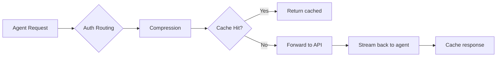
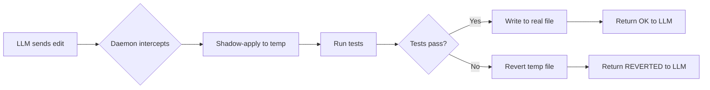
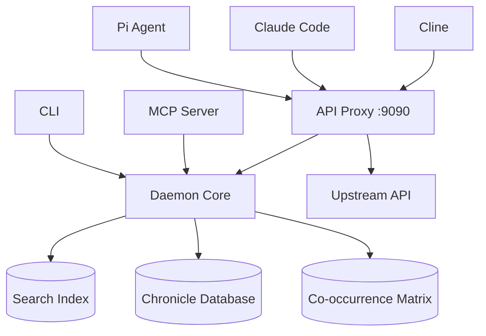

# reliary-agent

[](https://crates.io/crates/reliary-agent)
[](https://www.npmjs.com/package/@reliary/agent)
[](https://github.com/Reliary/reliary-agent/actions/workflows/ci.yml)
[](https://opensource.org/licenses/MIT)
[](https://securityscorecards.dev/viewer/?uri=github.com/Reliary/reliary-agent)

API proxy, code search, and edit safety. One binary, all local, no server required.

Route your agent's API calls through localhost:9090 to compress conversation history,
catch dangerous edits before they hit your filesystem, and search your codebase without
sending context to the LLM. Works with Pi, Claude Code, Cline, OpenCode, or any
OpenAI-compatible client.

- [Installation](#installation)
- [Quickstart](#quickstart)
- [Usage by Agent](#usage-by-agent)
- [Features](#features)
- [CLI Reference](#cli-reference)
- [Configuration](#configuration)
- [Architecture](#architecture)
- [Development](#development)

## Installation

```bash
# NPM (Recommended for Node.js developers)
npm install -g @reliary/agent

# Cargo (Recommended for Rust developers)
cargo install reliary-agent

# Homebrew (macOS / Linux)
brew install Reliary/tap/reliary-agent
```

## Quickstart

```bash
# Build a search index for your project
reliary-agent index ./project

# Start the daemon and API proxy on port 9090
reliary-agent serve &

# Auto-detect and configure agents (Pi, Claude, Cline, OpenCode)
reliary-agent init

# Run a search against the local index
reliary-agent search "bm25_idf" ./project
```

After `init`, your agents get MCP tools for search, risk, compression, fix, dead code
detection, healing, and prior session memory. For conversation compression, point your
agent's `*_BASE_URL` at http://localhost:9090.

## Usage by Agent

There are two separate things reliary gives your agent. Understanding the difference
is key:

1.  **MCP tools** (search, risk, dead code detection, fix patterns). These work
    through your agent's MCP configuration, which `reliary-agent init` sets up
    automatically. Available to Claude Code, Cline, and OpenCode. Pi does not support
    MCP -- it uses the gate.js extension instead.
2.  **API Proxy** (conversation compression, edit safety, response caching). This works
    by routing your agent's API calls through localhost:9090. Every agent can use it --
    just set a `*_BASE_URL` environment variable. The proxy auto-discovers your
    upstream provider by scanning agent configs and environment variables.

### Pi (gate.js extension)

Pi is the only agent that does not support MCP. Instead, it uses the gate.js extension
to intercept tool calls. It also uses the proxy for compression like every other agent.

```bash
# 1. Install reliary-agent
npm install -g @reliary/agent
# or: cargo install reliary-agent

# 2. Install gate.js + configure Pi
reliary-agent init

# 3. Start the proxy
reliary-agent serve &

# 4. Tell Pi to route API calls through the proxy
export OPENAI_BASE_URL=http://localhost:9090/v1

# 5. Use Pi normally -- compression happens transparently
pi --model gpt-4o --print "fix this bug"
```

What you get:
- Proxy compression + edit safety (API calls go through localhost:9090)
- Gate.js extension (compresses tool outputs, self-healing edits, strict mode)
- Transparent strict mode: bash/write/grep are redirected to sandbox tools without
  the LLM seeing errors
- Self-healing edits: tests run before the LLM sees failures
- Default mode: **strict** (redirects risky commands, auto-deescalates after 5
  redirects per tool)

To verify it's working:
```bash
reliary-agent doctor            # Check gate.js is installed
reliary-agent status            # Check proxy is running
```
Then check your Pi session -- you should see gate.js loading at startup and the
proxy logging API calls to `/tmp/reliary_proxy.jsonl` (or the RELIARY_LOG_FILE
path).

**Common pitfalls:**
- If `*_BASE_URL` is not set, Pi bypasses the proxy and no compression happens
- If gate.js was installed before `reliary-agent serve` was running, restart Pi
- gate.js requires `OPENAI_BASE_URL` (not `DEEPSEEK_BASE_URL` or `ANTHROPIC_BASE_URL`)
  because Pi uses OpenAI-compatible format regardless of which model you use

### Claude Code

Claude Code uses MCP for code intelligence tools (search, risk, dead code) and the
proxy for conversation compression.

```bash
# 1. Install reliary-agent
npm install -g @reliary/agent

# 2. Auto-configure MCP tools (writes to ~/.claude.json)
reliary-agent init

# 3. Start the proxy
reliary-agent serve &

# 4. Tell Claude to route API calls through the proxy
export ANTHROPIC_BASE_URL=http://localhost:9090/

# 5. Start Claude Code
claude
```

What you get:
- Proxy compression + edit safety (API calls go through localhost:9090)
- MCP tools: `reliary_search`, `reliary_compress`, `reliary_risk`, `reliary_fix`,
  `reliary_dead`, `reliary_heal`, `reliary_prior` -- discoverable by Claude
- No transparent redirect (Claude uses its own Bash tool, which reliary does not
  intercept for Claude)

To verify it's working:
```bash
cat ~/.claude.json | grep reliary    # Check MCP config was injected
reliary-agent status                  # Check proxy is running
```

Inside Claude, ask: "what MCP tools are available?" -- you should see the reliary_
tools listed.

**Common pitfalls:**
- `ANTHROPIC_BASE_URL` must end with a trailing `/` (Claude Code is picky about this)
- If you set `ANTHROPIC_BASE_URL` after Claude is already running, restart Claude
- MCP tools only appear if `init` was run and `~/.claude.json` contains the reliary
  entry. Run `reliary-agent doctor` to check

### Cline / OpenCode

Both agents use MCP for code intelligence tools and the proxy for compression.

```bash
# 1. Install reliary-agent
npm install -g @reliary/agent

# 2. Auto-configure MCP tools
reliary-agent init

# 3. Start the proxy
reliary-agent serve &

# 4. Tell your agent to route API calls through the proxy
#    (match the env var to what your provider expects)
export OPENAI_BASE_URL=http://localhost:9090/v1

# 5. Start your agent
```

What you get:
- Proxy compression + edit safety
- MCP tools -- auto-injected by `init`
- No gate.js (Pi-only extension)

To verify it's working:
```bash
reliary-agent doctor           # Check MCP config and proxy
reliary-agent status           # Show proxy route count
```

In OpenCode, check `~/.config/opencode/opencode.json` for the `mcpServers.reliary`
entry. In Cline, check `~/.config/Code/User/globalStorage/rooveterinaryinc.roo-cline/settings/cline_mcp_settings.json`.

**Common pitfalls:**
- OpenCode uses `~/.config/opencode/opencode.json` (Linux), 
  `~/Library/Application Support/opencode/opencode.json` (macOS), or
  `%APPDATA%/opencode/opencode.json` (Windows)
- The env var must match your provider: `OPENAI_BASE_URL` for OpenAI-compatible
  providers, `ANTHROPIC_BASE_URL` for Anthropic, etc.
- Cline expects MCP config in its settings JSON, not in `~/.claude.json`

### Any agent (proxy-only, no MCP)

If your agent supports OpenAI-compatible API endpoints, you can still get proxy
compression without MCP tools:

```bash
# 1. Install and start the proxy
cargo install reliary-agent
reliary-agent serve &

# 2. Point your agent at the proxy
export OPENAI_BASE_URL=http://localhost:9090/v1

# 3. Set a fallback upstream (the proxy needs to know where to forward to)
export RELIARY_UPSTREAM_URL=https://api.openai.com/v1

# 4. Run your agent
```

You get proxy compression only (no MCP tools, no gate.js, no guard safety checks).
The savings table below assumes the reliary+agent pairing with max features enabled.

### Savings by Agent Stack

### Savings by Agent Stack

| Agent | Stack | Savings |
|---|---|---|
| **Pi** | Proxy + guard + gate.js | **16-84% weighted cost** |
| **Claude Code** | Proxy + guard + MCP | **16-60%** |
| **Cline / OpenCode** | Proxy + guard + MCP | **16-60%** |
| **Any agent** | Proxy only (passthrough) | **0%** (just routing) |

Long multi-turn sessions (15+ turns) hit the highest savings. Short 3-turn fixes hit
the lower end. The safety guards eliminate catastrophic debug spirals.

## Features

### Token Compression (API Proxy)

The `serve` command starts an OpenAI-compatible proxy on `localhost:9090`. Point your
agent's `*_BASE_URL` here to route all API calls through the proxy. The proxy discovers
your upstream from your agent's provider config, or you can set `RELIARY_UPSTREAM_URL`
as a global fallback.

| Mechanism | Savings | How it works |
|---|---|---|
| **First-appearance freeze** | 16-84% | Compresses each message the first time it appears and caches the result. The provider never sees the uncompressed version. |
| **Command output compression** | 10-20% | Collapses noisy terminal output (like 100 lines of `Compiling...`) into a 1-line summary while preserving compiler errors and stack traces. |
| **Response cache** | 0-100% | Repeated identical requests return cached results at zero API cost. |



### Self-Healing Edits

When the LLM edits a file, reliary shadow-applies the change, runs your test suite,
and reverts the file if tests fail. The LLM never sees the failure spiral. Toggle with
`features.healEdit` (on by default, disable via `RELIARY_FEATURES=-healEdit`).



### Safety & Guardrails

- **Cross-File Edit Guard (on by default):** Intercepts edits and checks them against
  the local search index. If an edit would orphan cross-file references (like renaming
  a function without updating callers), a warning is injected before the edit reaches
  the LLM.
- **Anti-Decision Memory (on by default):** Cross-session learning. If the LLM repeatedly
  tries and fails to use a specific identifier across sessions, the proxy injects a
  subtle warning the next time it tries, conditioning the LLM to stop repeating the
  mistake.
- **Transparent Strict Mode (Pi only):** Instead of blocking risky commands (like
  blind `sed` replacements) with error messages, the agent transparently redirects
  them to safe sandbox tools.
- **Identifier Veto:** Blocks edits that reference hallucinated function or variable
  names.
- **Risk Gate:** Warns the agent before it edits files with a high blast radius.

### Code Intelligence (MCP Tools)

Seven tools available through standard MCP, working natively with Claude Code, Cline,
and OpenCode:

- `reliary_search` -- BM25 code search against local FTS5 index
- `reliary_compress` -- IR reasoning compression
- `reliary_risk` -- Pre-edit risk analysis
- `reliary_fix` -- Pattern-based file fix
- `reliary_dead` -- Grammar-free dead code detection (compact summary + top-N)
- `reliary_heal` -- Apply edit with self-healing (test before commit)
- `reliary_prior` -- Chronicled project state and cross-session memory

## CLI Reference

### Core

```bash
reliary-agent serve                              # Start daemon + proxy on :9090
reliary-agent start                              # Start daemon in background
reliary-agent stop                               # Stop background daemon
reliary-agent doctor                             # System health check
reliary-agent doctor --fix                       # Check + auto-fix issues
reliary-agent status                             # Project intelligence overview
reliary-agent init                               # Auto-configure agents (Pi, Claude, Cline)
reliary-agent uninstall                          # Remove all integrations
```

### Search & Index

```bash
reliary-agent index ./project                    # Build search index
reliary-agent search "query" ./path              # Search index
reliary-agent risk ./src/file.rs                 # Pre-edit risk analysis
reliary-agent dead ./src                         # Dead code detection
```

### Compression

```bash
reliary-agent compress < input.txt               # IR reasoning compression (stdin)
reliary-agent sift cargo test                    # Pipe command output through compression
```

### Configuration

```bash
reliary-agent config                             # Show current config + file paths
reliary-agent config mode fast                   # Set gate mode (fast/reactive/strict)
reliary-agent config --local mode strict         # Set in project .reliary/config.json
reliary-agent clean                              # Wipe project .reliary (with confirmation)
reliary-agent clean --global                     # Wipe ~/.reliary
reliary-agent clean --all                        # Wipe both
reliary-agent logs                               # Tail daemon logs
reliary-agent logs --tail                        # Follow in real-time
reliary-agent logs --level debug                 # Filter by level
```

### Utilities

```bash
reliary-agent --format json search "query" .     # JSON output for scripts/CI
reliary-agent --format compact search "query" .  # Minimal output for agents

reliary-agent completions bash                   # Generate bash completions
reliary-agent completions zsh                    # Generate zsh completions
reliary-agent completions fish                   # Generate fish completions
reliary-agent completions powershell             # Generate PowerShell completions
reliary-agent completions bash --outdir ./dir    # Write completions to directory
reliary-agent man                                # Generate man page (stdout)
reliary-agent man --outdir ./man/man1            # Write man page to directory
reliary-agent trust .                            # Quick project setup (create .reliary + index)
reliary-agent update --check                     # Check for updates without installing
reliary-agent update                             # Download and install latest release

reliary-agent -v search "query" .                # Verbose output
reliary-agent -q search "query" .                # Quiet (errors only)
NO_COLOR=1 reliary-agent status                  # Disable colored output
```

### Hidden Commands

These exist in the binary but are not shown in `--help`. They are used internally by
the daemon, MCP server, and gate.js extension:

```bash
reliary-agent daemon        # TCP daemon (deprecated -- use 'serve')
reliary-agent mcp           # Micro-MCP server (stdio transport)
reliary-agent apply-edit    # Self-healing edit with test verification
reliary-agent veto          # Identifier veto check (stdin-based)
reliary-agent fix-dir       # Apply known fix patterns to directory
reliary-agent fix-file      # Apply fix to single file
reliary-agent memory        # Cross-session memory info
reliary-agent session-state # Build session state block from Pi file
```

## Configuration

See [CONFIG.md](./CONFIG.md) for full documentation on the cascading configuration
system.

### Quick Reference

| Env var | Effect |
|---|---|
| `RELIARY_MODE=fast` | Maximum compression (no safety rails) |
| `RELIARY_MODE=reactive` | Safety escalates on unsafe behavior |
| `RELIARY_MODE=strict` | Full sandbox -- transparently redirects risky commands (default) |
| `RELIARY_FEATURES=+editMerge,-healEdit` | Toggle individual features |
| `RELIARY_UPSTREAM_URL=https://api.openai.com/v1` | Default upstream for unknown API keys |
| `RELIARY_PROXY_GUARD_DISABLE=1` | Disable cross-file edit safety |
| `RELIARY_PROXY_ANTI_DISABLE=1` | Disable Anti-decision memory |

### Features

| Feature | Default | Description |
|---|---|---|
| `compress` | on | Reasoning compression on assistant messages |
| `convWindow` | on | Conversation window collapsing for old messages |
| `readEnrichment` | on | Enrich file reads with structural summaries |
| `editMerge` | off | Merge consecutive edits (regressed on high-variance models) |
| `healEdit` | on | Self-healing: test edits before applying |
| `priorInjection` | off | Inject prior session knowledge (overhead exceeds benefit) |

## Architecture

This binary consolidates 9 crates into one executable with a shared tokenizer and
session state (zero IPC overhead).



- **search:** Fast local search using BM25 and stemming
- **compress:** Reasoning compression
- **sift:** Terminal output compression and noise reduction
- **risk:** Pre-edit risk scoring and blast radius calculation
- **memory:** Cross-session learning and recall
- **fix:** Pattern extraction and forgiving signature matching
- **dead:** Dead code detection via occurrence counting
- **agent:** The core binary serving the daemon, proxy, CLI, and MCP

## Troubleshooting

### "Proxy is not compressing anything"

```bash
reliary-agent status    # Check proxy is running on :9090
```

Then check your agent's `*_BASE_URL` env var is set correctly. Without it, the agent
bypasses the proxy entirely. Each agent section above shows the exact var name.

### "MCP tools not showing up"

```bash
reliary-agent doctor    # Check which agents are wired
```

If doctor says the agent is not wired, run `reliary-agent init` and answer Y for
that agent. If doctor says it is wired but the agent does not see the tools, restart
the agent -- MCP config is read at agent startup.

### "`reliary-agent serve` fails with 'address in use'"

Something else is running on port 9090. Either:
```bash
# Stop whatever is on 9090, or use a different port
reliary-agent serve 9091
export OPENAI_BASE_URL=http://localhost:9091/v1
```

### "Proxy is running but API calls hang"

The proxy needs to know where to forward requests. If your API key is not recognized,
set `RELIARY_UPSTREAM_URL` as a fallback:

```bash
export RELIARY_UPSTREAM_URL=https://api.openai.com/v1
reliary-agent serve &
```

Or run `reliary-agent init` to generate `proxy-routes.json` from your agent configs.

### "gate.js extension not loading in Pi"

Check the extension is installed:
```bash
ls ~/.local/share/reliary/gate.js    # Should exist
```

If it was installed before the daemon was running, restart Pi. The extension checks
daemon health at startup and degrades gracefully if the daemon is down (no compression
but no errors).

### "I'm not seeing any token savings"

Proxy compression compounds on long sessions (15+ turns). Short 3-turn sessions see
modest savings. The first-appearance freeze only matters after the first turn. Run
a multi-turn task (like fixing a bug in a large file) and compare API billing --
that is where the 16-84% range comes from.

## Development

```bash
cargo build --release
cargo test --release -- --test-threads=1
reliary-agent serve &    # start daemon + proxy
```

## Documentation

- **[CONFIG.md](./CONFIG.md)** -- Mode system, feature flags, config cascade
- **[SECURITY.md](./SECURITY.md)** -- Vulnerability disclosure and security policy
- **[CONTRIBUTING.md](./CONTRIBUTING.md)** -- Build, test, PR workflow
- **[pi/GATE.md](./pi/GATE.md)** -- Pi extension reference

## License

MIT
